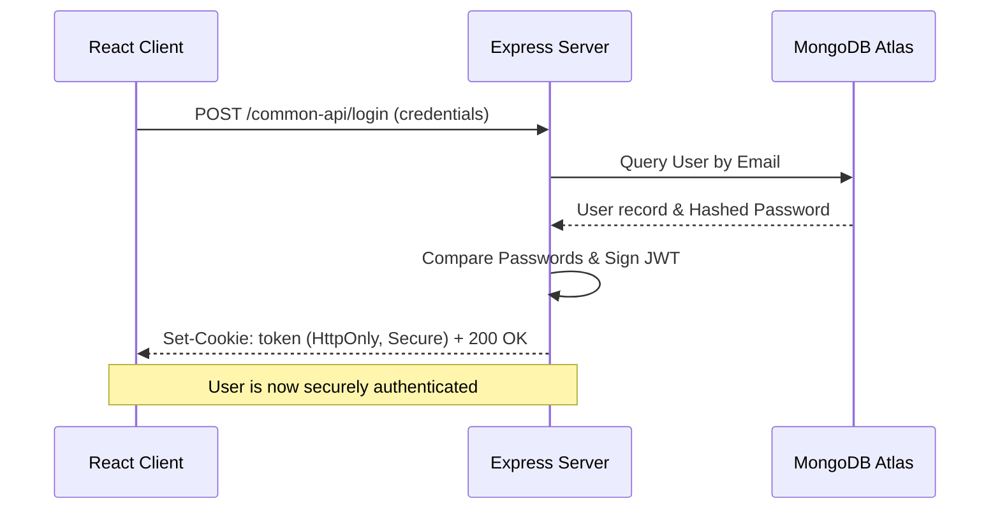

# 📝 BlogApp — Full-Stack MERN Capstone Project

BlogApp is a premium, secure, and modern full-stack blogging application built using the MERN stack (MongoDB, Express, React, Node.js). Engineered with a robust role-based access control system (supporting **Users**, **Authors**, and **Admins**), it provides a complete publishing workflow, smooth media uploads, and a distraction-free Apple-inspired reading interface.

---

## 🌟 Key Features

*   **Security First:** Secure authentication powered by JWT tokens stored in secure, client-hidden `HttpOnly` cookies.
*   **Role-Based Access Control (RBAC):**
    *   **USER:** Read articles, view author profiles, and post comments on active articles.
    *   **AUTHOR:** Create, edit, soft-delete/restore, and manage their own articles.
    *   **ADMIN:** Manage user roles, system states, and moderate content.
*   **Smooth Media Integration:** Profile image upload stream powered by **Multer** and **Cloudinary** (direct memory buffer upload pipeline).
*   **Aesthetic & Modern UI:** Designed with an **Apple Light-style Design System**—focused on clean typography, precise spacing, and rich micro-interactions.
*   **Console-Clean UX:** Graceful page refresh session verification (`check-auth`) that avoids common red browser console errors.
*   **Comprehensive Error Handling:** User-friendly Mongoose validation mapping and automatic Cloudinary asset rollback on registration failure.

---

## 💻 Tech Stack

| Layer | Technology | Primary Purpose |
| :--- | :--- | :--- |
| **Frontend** | React 19 (Vite) | Fast, responsive UI with HMR |
| **Styling** | Vanilla CSS + Tailwind | Apple Light design system & tokens |
| **State** | Zustand | Light, highly efficient central state store |
| **Routing** | React Router v7 | Declarative routing & dynamic view layout |
| **Backend** | Express 5 | Modular and scalable HTTP API |
| **Database** | MongoDB & Mongoose | Document database with schema validations |
| **Media** | Cloudinary & Multer | Image storage & multi-part file parsing |
| **Auth** | JSON Web Tokens & BcryptJS | Secure session cookies & hash encryption |

---

## 📂 Project Structure

```text
BLOG-APP/
├── Backend/                     # Node.js + Express Server API
│   ├── APIs/                    # Router controllers (User, Author, Admin, Common)
│   ├── config/                  # Cloudinary and Multer configurations
│   ├── middlewares/             # JWT token verification & error middleware
│   ├── models/                  # Mongoose DB Schemas (User, Article)
│   ├── services/                # Business logic (Registration, Authentication)
│   ├── .env                     # Server environment variables
│   ├── server.js                # Server entry point
│   └── package.json
│
├── Frontend/                    # React Client Application
│   ├── public/                  # Static assets
│   ├── src/                     # Source directory
│   │   ├── components/          # Profile dashboards, Forms, Headers, footers
│   │   ├── store/               # Central state store (Zustand authStore)
│   │   ├── styles/              # Design tokens and styles (common.js)
│   │   └── App.jsx              # Main App wrapper & router configuration
│   ├── vite.config.js           # Vite server settings
│   └── package.json
│
└── README.md                    # Main Project Documentation (This File)
```

---

## ⚙️ Local Development Setup

To run this project locally, follow these steps:

### 1. Prerequisite & Clones
```bash
git clone <your-repository-url>
cd BLOG-APP
```

### 2. Backend Setup
1. Navigate to the `Backend` directory:
   ```bash
   cd Backend
   ```
2. Install dependecies:
   ```bash
   npm install
   ```
3. Create a `.env` file in the `Backend` root:
   ```env
   PORT=4000
   DB_URL=mongodb+srv://<username>:<password>@cluster0.mongodb.net/blogg-app
   JWT_SECRET=your_jwt_signature_secret
   CLOUD_NAME=your_cloudinary_cloud_name
   API_KEY=your_cloudinary_api_key
   API_SECRET=your_cloudinary_api_secret
   ```
4. Start the backend:
   ```bash
   node server.js
   ```

### 3. Frontend Setup
1. Open a new terminal and navigate to the `Frontend` directory:
   ```bash
   cd Frontend
   ```
2. Install dependencies:
   ```bash
   npm install
   ```
3. Start the development server:
   ```bash
   npm run dev
   ```

---

## 🛡️ Security & Authentication Flow



1. **HttpOnly Cookies:** The session JWT is stored in an `HttpOnly` cookie. This makes it completely inaccessible to client-side scripts, protecting it from Cross-Site Scripting (XSS) attacks.
2. **Graceful checkAuth:** The `/common-api/check-auth` endpoint performs dynamic verification. Instead of returning raw `401` errors that pollute the developer console, it responds with a clean `200 OK` status and a boolean `isAuthenticated: false` flag if no session cookie exists.

---

## 👥 Contributors & License

*   **Author:** Capstone Development Team
*   **License:** ISC License
